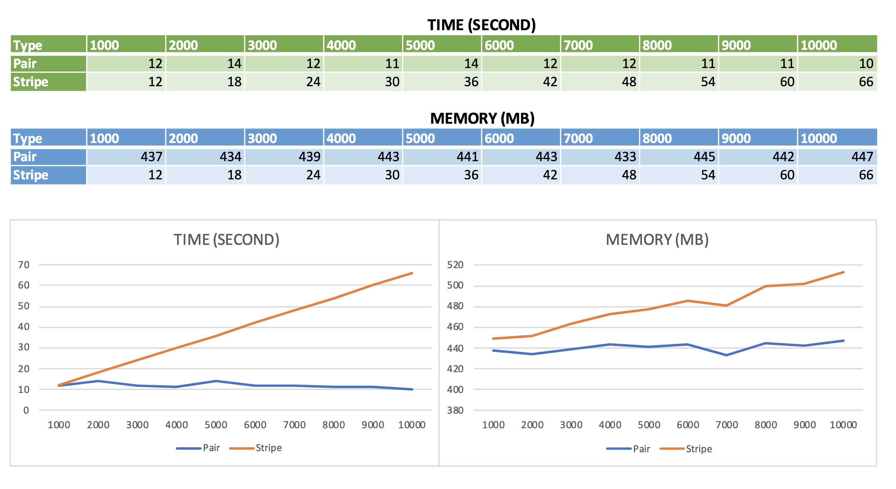

# Development

## IntelliJ IDE (only works with *unix OS)

Help us to run the Hadoop client without running the Hadoop system.

1. Create the configuration as picture


2. Make sure the Java compiler is set up equivalent to the configuration


# Deploy to hadoop

1. Stay at the root of the project

2. (Optional) Clean the docker container
```bash
sh scripts/0_clean.sh
```

3. We will use the `sequenceiq/hadoop-docker:2.7.1` as the Hadoop Single Cluster. 
This project will create the container name as `hadoop-2`.
Run these commands in sequential order:
```bash
sh scripts/1_create_docker_container.sh

sh scripts/2_copy_req_files.sh

sh scripts/3_go_to_docker.sh
```

4. Now you are in the docker terminal, run this command to setup for this project
```bash
sh /usr/share/hadoop/4_in_docker_prepare.sh
```

5. Now you can execute the MapReduce for the requirements with these commands:
```bash
sh /usr/share/hadoop/4_in_docker_exec_p1a.sh
sh /usr/share/hadoop/4_in_docker_exec_p1b.sh
sh /usr/share/hadoop/4_in_docker_exec_p1c.sh
sh /usr/share/hadoop/4_in_docker_exec_p1d.sh
sh /usr/share/hadoop/4_in_docker_exec_p2.sh
sh /usr/share/hadoop/4_in_docker_exec_p3.sh
sh /usr/share/hadoop/4_in_docker_exec_p4.sh
```

(Optional)
Manually, you can execute any job without above scripts using these commands:
```bash
(syntax)
bin/hadoop jar hadoopProject.jar <p1a,p1b,p1c,p1d,p2,p3,p4> <inputPath> <outputPath> [<numReducers>]
```

For example:
```bash
Run the MapReduce Job for P1D)
bin/hadoop jar hadoopProject.jar p1d project/input/P1D project/output/P1D

(Show the output of the job)
bin/hadoop fs -cat /user/root/project/output/P1D/*
```


6. The output of hadoop map reduce job will contain the metrics to show the resources usage, and the output of the job
For example, after executed this script
```bash
sh /usr/share/hadoop/4_in_docker_exec_p1a.sh
```

We could get below information in console
```
=== JobId: job_1666212928729_0001 ===
CPU: 3 s
Memory: 1241 MB
=====================================

...

cat     3
fat     1
lat     1
oat     2
rat     3
jat     1
mat     3
pat     4
sat     2
bat     2
eat     2
hat     3
kat     1
wat     1
zat     1
```

# P4: Empirical Comparison
The CPU, and Memory comparison of Pair, Stripe algorithms on the data in `input/P4` 


# Requirements

## Part 1

### [3 points] Set up a single node cluster and optionally an IDE to create and test your programs.

(a) Get WordCount (test run)

(b) Modify WordCount to InMapperCombiningWordCount and test run

(c) Implement Average Computation Algorithm to compute the average of the "last quantity" (7352) in a Apache log file for each ip address ("the first quantity"). If it is not an ip address, please ignore that record.

```
64.242.88.10 - - [07/Mar/2004:16:1:58 -0800] "GET /twiki/bin/view/TWiki/WikiSyntax HTTP/1.1" 200 7352
```
Use the data file attached.

(d) Implement the in-mapper combining version of the Average Computation Algorithm to compute the average of the "last quantity" in a Apache access log file for each ip address ("the first quantity).

```
64.242.88.10 - - [07/Mar/2004:16:11:58 -0800] "GET /twiki/bin/view/TWiki/WikiSyntax HTTP/1.1" 200 7352
```
Use the data attached.   (After extracting you will get the log file and one another file. Please use the log file).

For (a) - (d) you must submit java files, input files, output files.

## PART 2 - 4

Next you will create `a crystal ball to predict events` that may happen once a certain event happened.

_Example: Amazon will say people who bought “item one” have bought the following items : “item two”, “item three”, “item four”._

For the purpose of this project you can assume that historical customer data is available in the following form. <u>Each record contains the product IDs of all the product bought by one customer.</u>

#### TEST DATA (You must use this for Part 2 and 3)
```
B76 C31 D76 A10 B76 C31 D76 C31 A10 B12 B76  A12 C31 D76 B12 C31 D76    // items bought by a customer, listed in the order she bought it
D76 D76 B12 A10 C31 D76 B12  C31 D76 A12 C31 C31 D76 A12 B76 C31 D76  // items bought by another customer, listed in the order she bought it
```
...
```
Let the Window of X, W(X) be set of all term after X and before the next X.

Example: Let Data block be [a b c a d e]
W(a) = {b, c}, W(b) = {c, a, d, e}, W(c) = {a, d, e}, W(a) ={d, e}, W(d) = {e}, W(e) = {}.
```

### Part 2. Implement Pairs algorithm to compute relative frequencies.

- **_[4 points]_** Create Java classes (.java files)
- **_[1 points]_** Show input, output and batch file to execute your program at command line in Hadoop.

### Part 3. Implement Stripes algorithm to compute relative frequencies.

- **_[4 points]_** Create Java classes (.java files)
- **_[1 points]_** Show input, output and batch file to execute your program at command line in Hadoop.

### Part 4. Empirical Comparison

- **_[2 Points]_** Run the test data specific to your group and collect data on memory usage and time for both pair and stripe approach. Write your observations citing data.