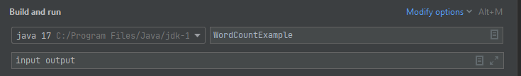
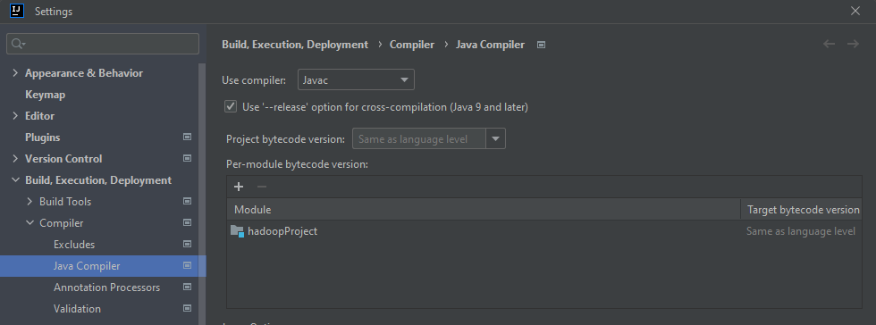
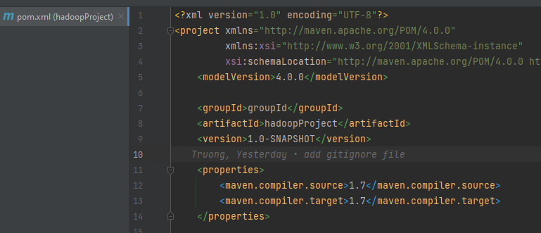

# Running Application

## On Hadoop


```bash
bin/hadoop jar hadoopProject.jar Main <p1a,p1b,p1c,p1d,p2,p3,p4> <inputPath> <outputPath> [<numReducers>]
```

## On IntelliJ Idea (only works with *unix OS)

1. Create the configuration as picture


2. Make sure the Java compiler is set up equivalent to the configuration



# Requirements

## Part 1

### [3 points] Set up a single node cluster and optionally an IDE to create and test your programs.

(a) Get WordCount (test run)

(b) Modify WordCount to InMapperCombiningWordCount and test run

(c) Implement Average Computation Algorithm to compute the average of the "last quantity" (7352) in a Apache log file for each ip address ("the first quantity"). If it is not an ip address, please ignore that record.

```
64.242.88.10 - - [07/Mar/2004:16:1:58 -0800] "GET /twiki/bin/view/TWiki/WikiSyntax HTTP/1.1" 200 7352
```
Use the data file attached.

(d) Implement the in-mapper combining version of the Average Computation Algorithm to compute the average of the "last quantity" in a Apache access log file for each ip address ("the first quantity).

```
64.242.88.10 - - [07/Mar/2004:16:11:58 -0800] "GET /twiki/bin/view/TWiki/WikiSyntax HTTP/1.1" 200 7352
```
Use the data attached.   (After extracting you will get the log file and one another file. Please use the log file).

For (a) - (d) you must submit java files, input files, output files.

## PART 2 - 4

Next you will create `a crystal ball to predict events` that may happen once a certain event happened.

_Example: Amazon will say people who bought “item one” have bought the following items : “item two”, “item three”, “item four”._

For the purpose of this project you can assume that historical customer data is available in the following form. <u>Each record contains the product IDs of all the product bought by one customer.</u>

#### TEST DATA (You must use this for Part 2 and 3)
```
B76 C31 D76 A10 B76 C31 D76 C31 A10 B12 B76  A12 C31 D76 B12 C31 D76    // items bought by a customer, listed in the order she bought it
D76 D76 B12 A10 C31 D76 B12  C31 D76 A12 C31 C31 D76 A12 B76 C31 D76  // items bought by another customer, listed in the order she bought it
```
...
```
Let the Window of X, W(X) be set of all term after X and before the next X.

Example: Let Data block be [a b c a d e]
W(a) = {b, c}, W(b) = {c, a, d, e}, W(c) = {a, d, e}, W(a) ={d, e}, W(d) = {e}, W(e) = {}.
```

### Part 2. Implement Pairs algorithm to compute relative frequencies.

- **_[4 points]_** Create Java classes (.java files)
- **_[1 points]_** Show input, output and batch file to execute your program at command line in Hadoop.

### Part 3. Implement Stripes algorithm to compute relative frequencies.

- **_[4 points]_** Create Java classes (.java files)
- **_[1 points]_** Show input, output and batch file to execute your program at command line in Hadoop.

### Part 4. Empirical Comparison

- **_[2 Points]_** Run the test data specific to your group and collect data on memory usage and time for both pair and stripe approach. Write your observations citing data.